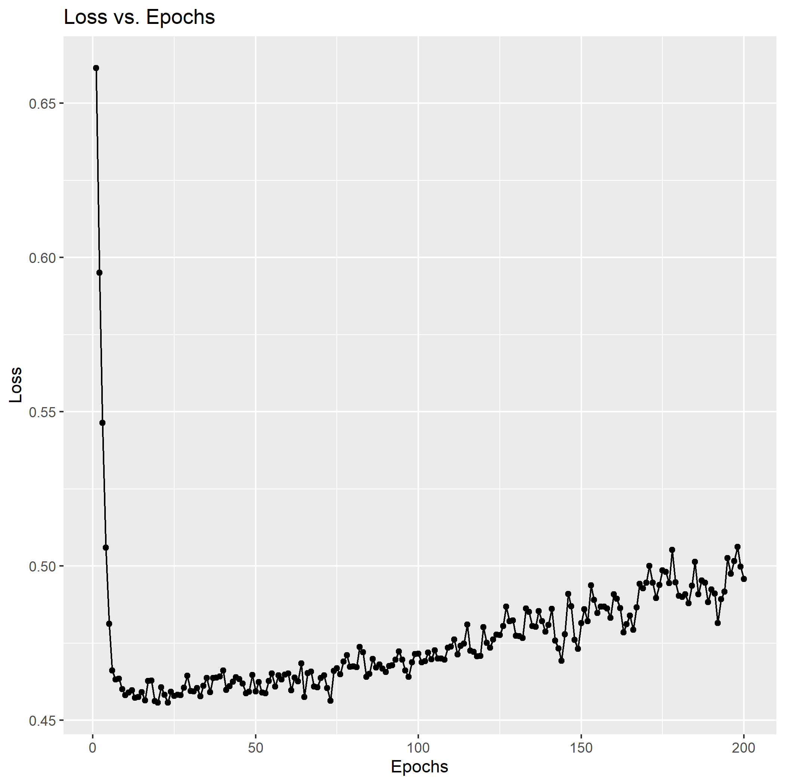
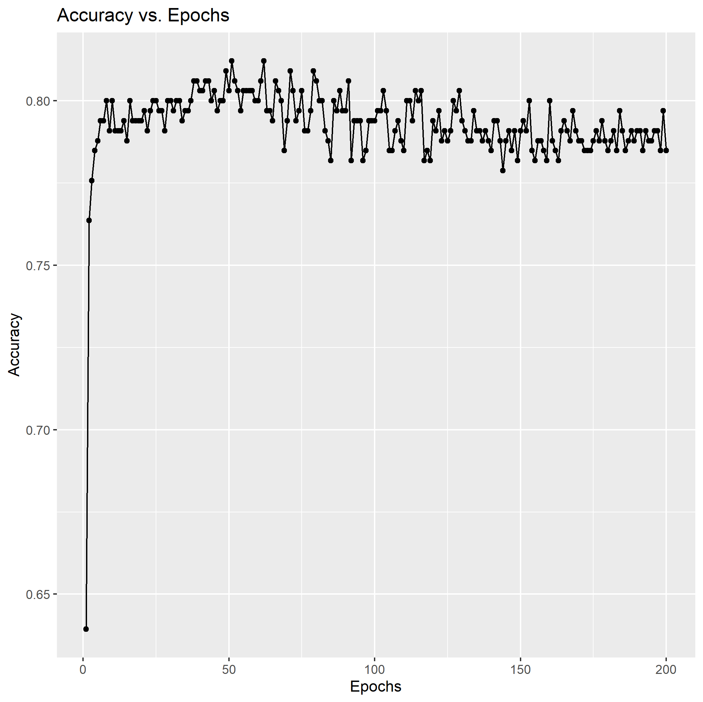

# Titanic 

A keras model trained on the [Titanic dataset](https://www.kaggle.com/c/titanic/data) to predict survival rates for passengers.

## Languages

R - Data Science

Python - Model

## Model Structure

|LayerType|Units/Rate|Activation|
|---------|-----|----------|
|Dense|64|relu|
|Dropout|0.2||
|Dense|64|relu|
|Dropout|0.2||
|Dense|1|sigmoid|

Epochs: 200

Batch Size: 64

## The Task

The task is to accurately identify if a person survived or not based on their details (such as ticket fare, gender, age, and class). The model will have to connect all these unrelated features and determine if the person survived the Titanic catastrophe or not.

## The Process

First, I began by using basic R techniques to plot the various features of the training dataset to see the distribution of the data. These features allowed me to view what parts of the data needed cleaning and what parts were fine.

I noticed that there were several NA values in the dataset which had to be fixed. A majority of these were in the "Cabin" column so I decided to just drop that column from the data. For the remaining few NA values, I found the mean of the specific column and replaced the NA values with the mean.

While also looking at the raw data, I noticed that the outputs were not evenly distributed. There were far less people who survived than those who died, indicating that some form of sampling would be necessary to even this out and generalize the model. I used oversampling here to get equal values for those who survived and those who didn't.

With the data almost completely clean, I converted the columns which had "character" values into numerical values by one hot encoding them.

I then repeated these steps with the test dataset.

I then used R to plot the processed data and make sure everything is cleaned.

However, the data was not yet completely processed. I used a "StandardScaler" to scale all the values in the data so that large values in a specific column won't confuse the model. Then, I split the training data so that I could also get a validation dataset to test my model while training by using a factor of 0.3. 

Next, I began creating the model. Using the structure I showed above in the previous section, I made a deep learning model and trained it on the data for 200 epochs. I purposely chose such a high number of epochs so that the model would overfit and I would know approximately how many epochs to use after analysing the performance. I stored the history of the model into a variable,converted it into a dataframe, and saved it to a csv file.

Now, it's time for analysing the history of the model. Once again, I used "R" to plot the "validation_loss" and "validation_accuracy" of the model.

As you can see in these images, after around 20 epochs, the model's rate of increase in performance drastically dropped. When the model passed 20 epochs, that was when it began to overfit on the data.

Now that I knew how many epochs to use, I created another identical model. Except this time, I didn't use any validation dataset and trained all the training data. After evaluating the results on the test data, the model achieved a performance of 89%, which is pretty good for such a complicated task.

## The Files

Each file and its purpose in this project (in chronological order).

|FileName|Purpose|
|--------|-------|
|[raw_data.rmd](./raw_data.rmd)|Analysing the raw dataset|
|[clean.py](./clean.py)|Cleans the dataset by removing NA values and unnecessary features|
|[processed_data.rmd](./processed_data.rmd)|Analysing the processed data|
|[overfit.py](./overfit.py)|Creating a model that intentionally overfits the data|
|[overfit.rmd](./overfit.rmd)|Analysing the performance of the model throughout epochs|
|[optimal.py](./optimal.py)|Creating a model with the optimal number of epochs|

The "data/raw" directory contains all the raw data. The "data/processed" directory contains all the data after processing it.

The "model" folder contains the stats for the "overfitting" and "optimal" model.
